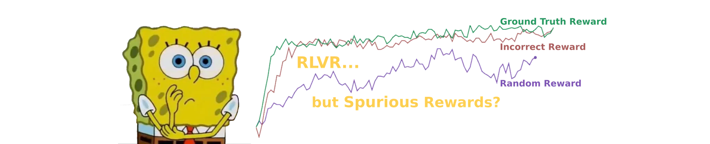

# 💭 Spurious Rewards: Rethinking Training Signals in RLVR

<div align="center">



[](https://github.com/Anderson-ce/Rethink_RLVR/releases)

</div>

## Overview

Welcome to the Rethink_RLVR repository! This project explores the challenges posed by spurious rewards in reinforcement learning and vision-based reinforcement learning (RLVR). Our aim is to rethink how training signals are structured and to provide a clearer understanding of their impact on learning outcomes.

## Table of Contents

1. [Introduction](#introduction)
2. [Research Background](#research-background)
3. [Key Contributions](#key-contributions)
4. [Installation](#installation)
5. [Usage](#usage)
6. [Results](#results)
7. [Contributors](#contributors)
8. [License](#license)
9. [Contact](#contact)

## Introduction

Reinforcement learning has shown great promise in various applications. However, the presence of spurious rewards can mislead agents during training. This project investigates these phenomena and proposes new methodologies to improve training signals in RLVR.

## Research Background

The concept of spurious rewards refers to misleading signals that can cause an agent to learn incorrect behaviors. Traditional reinforcement learning methods often struggle to differentiate between genuine rewards and these spurious signals. Our research delves into the mechanisms behind these rewards and their implications for training efficiency and effectiveness.

### Key Challenges

- **Identifying Spurious Rewards**: Understanding how these rewards manifest in different environments.
- **Mitigating Misleading Signals**: Developing techniques to minimize the impact of spurious rewards on learning.

## Key Contributions

- **Novel Framework**: We introduce a new framework for analyzing training signals in RLVR.
- **Empirical Studies**: Our experiments provide insights into the effects of spurious rewards across various scenarios.
- **Guidelines for Future Research**: We offer recommendations for designing better training environments that reduce the likelihood of spurious rewards.

## Installation

To get started with the Rethink_RLVR project, follow these steps:

1. **Clone the Repository**:
   ```bash
   git clone https://github.com/Anderson-ce/Rethink_RLVR.git
   cd Rethink_RLVR
   ```

2. **Install Dependencies**:
   Make sure you have Python installed. You can use pip to install the required packages:
   ```bash
   pip install -r requirements.txt
   ```

3. **Download Necessary Files**:
   Visit the [Releases section](https://github.com/Anderson-ce/Rethink_RLVR/releases) to download any necessary files for execution.

## Usage

After installation, you can run the training scripts. Here’s how to do it:

1. **Set Up Your Environment**:
   Ensure that your environment is correctly set up with the required configurations.

2. **Run the Training Script**:
   Use the following command to start the training process:
   ```bash
   python train.py --config config.yaml
   ```

3. **Monitor Progress**:
   The training logs will provide real-time updates on the agent's performance.

## Results

Our empirical studies reveal significant insights into the behavior of agents when faced with spurious rewards. Key findings include:

- **Performance Metrics**: We present graphs and charts that demonstrate how different training signals impact agent performance.
- **Comparative Analysis**: Our results compare traditional methods with our proposed framework, highlighting improvements in learning efficiency.

## Contributors

This project is a collaborative effort by the following researchers:

- [Rulin Shao](https://rulinshao.github.io/)
- [Shuyue Stella Li](https://stellalisy.com/)
- [Rui Xin](https://ruixin31.github.io/)
- [Scott Geng](https://www.scottgeng.com/)
- [Yiping Wang](https://ypwang61.github.io/)
- [Sewoong Oh](https://homes.cs.washington.edu/~sewoong/)
- [Simon Shaolei Du](https://simonshaoleidu.com/)
- [Nathan Lambert](https://www.natolambert.com/)
- [Sewon Min](https://www.sewonmin.com/)
- [Ranjay Krishna](https://www.ranjaykrishna.com/index.html)
- [Yulia Tsvetkov](https://homes.cs.washington.edu/~yuliats/)
- [Hannaneh Hajishirzi](https://homes.cs.washington.edu/~hannaneh/)
- [Pang Wei Koh](https://koh.pw/)
- [Luke Zettlemoyer](https://www.cs.washington.edu/people/faculty/luke-zettlemoyer/)

## License

This project is licensed under the MIT License. See the LICENSE file for details.

## Contact

For any questions or feedback, feel free to reach out to the contributors via their personal websites listed above.

For more updates and releases, please check the [Releases section](https://github.com/Anderson-ce/Rethink_RLVR/releases).

---

This README serves as a guide to understanding and utilizing the Rethink_RLVR project. Your contributions and feedback are welcome as we strive to improve the landscape of reinforcement learning research.